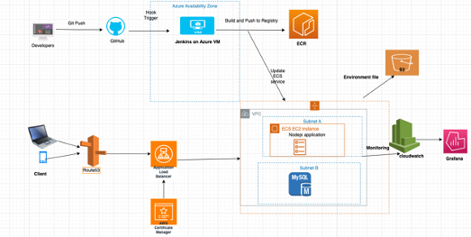

1 Take AWS for example. If this is two tier architecture, standard linux VM is AWS EC2.
1)	We need to hide port number 3000 from client, we can use route53+ALB to expose client a URL.
2)	Build this node application into a docker image, we can use docker port mapping to change the exposing port. And store docker image in AWS ECR.
3)	SQL database can host in a private subnet for security reasons.
4)	For more detailed requirements like availability, reliability and resiliency, we can deploy more ec2 instances in same availability zone or different zone or regions; for database, we can add read replica.
